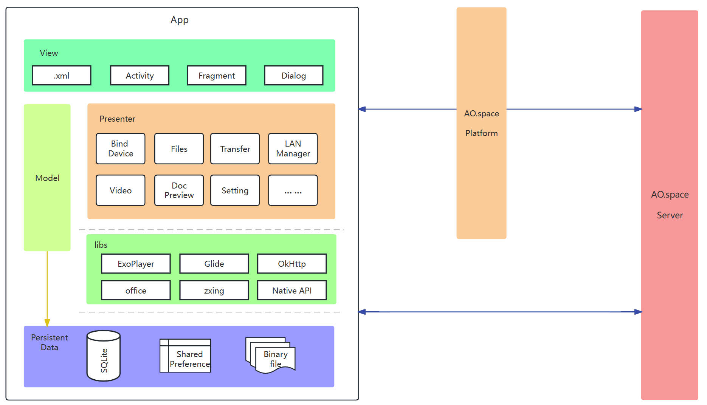

# client-android Introduction

Englis | [简体中文](./README_cn.md)

- [client-android Introduction](#client-android-introduction)
  - [Brief Introduction](#brief-introduction)
  - [System Architecture](#system-architecture)
  - [How to build \& use](#how-to-build--use)
    - [Environment](#environment)
    - [Source code download](#source-code-download)
    - [Deploy](#deploy)
  - [Contribution Guidelines](#contribution-guidelines)
  - [Contact us](#contact-us)
  - [Thanks for your contribution](#thanks-for-your-contribution)

## Brief Introduction

The client functions as the system's frontend, granting us with access to all functionalities of the AO.space. It encompasses Web, iOS, Android platforms, providing the following key modules:

- End-to-End Encryption Channel
- Files
- Devices
- Space Application
- Developer Options
- Security

## System Architecture



The Android client is developed using the Java language and adopts the MVP architecture design pattern. The service layer encapsulates functions such as device binding, code scanning authorization, file management, file upload/download, transmission list management, video playback, document preview, platform environment switching, and system upgrade. The data persistence layer uses SQLite, SharedPreference, and binary files to store local data such as file metadata, application configuration information, and cache files.

Through the LAN management module to determine the current network environment, in the same LAN in a direct connection to directly access the space server, in the non-LAN environment, through the platform to access the space server.

The Android client supports quick login on other terminal devices by scanning code authorization, making it easy for users to use multiple platforms anytime and anywhere.

## How to build & use

### Environment

- Install Java Development Kit (JDK) and configure the JAVA_HOME environment variable.

- Download and install Android Studio development tool. During the installation process, choose to install Android SDK and other necessary components.

- Create an Android Virtual Device (AVD), or use an Android phone. Open the Developer Options and connect the development device.

### Source code download

You can download the project as a whole through [https://github.com/ao-space/ao.space], or download this module's repository using the following command:

```html
git clone git@github.com:ao-space/client-android.git
```

### Deploy

Import the client-android project into Android Studio. Click "Run app" to directly run and debug the project on a virtual device/real device. Alternatively, click "Build - Generate Signed Bundle or APK", choose APK, and sign and package it with your own keystore file to install it as an APK on an Android phone.

## Contribution Guidelines

Contributions to this project are very welcome. Here are some guidelines and suggestions to help you get involved in the project.

[Contribution Guidelines](https://github.com/ao-space/ao.space/blob/dev/docs/en/contribution-guidelines.md)

## Contact us

- Email: <developer@ao.space>
- Website：[https://ao.space](https://ao.space)
- Discussion group：[https://slack.ao.space](https://slack.ao.space)

## Thanks for your contribution

Finally, thank you for your contribution to this project. We welcome contributions in all forms, including but not limited to code contributions, issue reports, feature requests, documentation writing, etc. We believe that with your help, this project will become more perfect and stronger.
