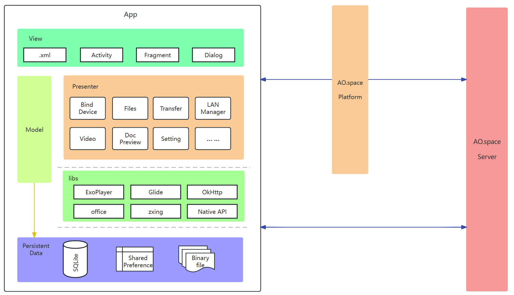

# client-android 介绍

[English](README.md) | 简体中文

- [client-android 介绍](#client-android-介绍)
  - [简介](#简介)
  - [架构设计](#架构设计)
  - [如何构建、如何使用](#如何构建如何使用)
    - [环境准备](#环境准备)
    - [源码下载](#源码下载)
    - [部署](#部署)
  - [贡献指南](#贡献指南)
  - [联系我们](#联系我们)
  - [感谢您的贡献](#感谢您的贡献)

## 简介

客户端是整个系统的前端，负责用户在不同的个人设备上与空间的交互，使用户能够随时随地访问空间的所有功能。目前提供 Web、iOS 和 Android 客户端，提供以下关键模块：

- 端到端加密通道
- 空间绑定
- 文件
- 设备
- 空间应用
- 安全

## 架构设计



傲空间 Android 客户端使用 Java 语言开发，采用了 MVP 架构设计模式。业务层封装了设备绑定、扫码授权、文件管理、文件上传/下载、传输列表管理、视频播放、文档预览、平台环境切换、系统升级等功能。数据持久化层，通过 SQLite、SharedPreference、二进制文件的方式，存储文件元数据、应用配置信息、缓存文件等本地数据。

通过局域网管理模块判断当前网络环境，在同局域网内以直连的方式直接访问傲空间服务器，在非局域网环境下，经由平台转发，访问傲空间服务器。

傲空间Android客户端支持通过扫码授权的方式，在其他终端设备上快速登录，方便用户随时随地多平台使用。

## 如何构建、如何使用

### 环境准备

- 安装 Java 开发工具包 (JDK)，配置 JAVA_HOME 环境变量
- 下载并安装 Android Studio 开发工具，在安装过程中，选择安装 Android SDK 和其他必要的组件
- 创建 Android 虚拟设备（AVD），或使用Android系统手机，打开开发者选项，连接开发设备

### 源码下载

可以使用[项目整体下载](https://github.com/ao-space/ao.space)的方式，也可以通过 clone 命令下载本模块的仓库：

```html
git clone git@github.com:ao-space/client-android.git
```

### 部署

使用 Android Studio 导入 client-android 项目。可在点击 `Run app` 直接在虚拟设备/真机上运行、调试项目。也可通过点击 `Build - Generate Signed Bundle or APK` ，选择 APK ， 使用自己创建的密钥库文件进行签名打包，以安装包的形式安装到Android系统手机上。

## 贡献指南

我们非常欢迎对本项目进行贡献。以下是一些指导原则和建议，希望能够帮助您参与到项目中来。

[贡献指南](https://github.com/ao-space/ao.space/blob/dev/docs/cn/contribution-guidelines.md)

## 联系我们

- 邮箱：<developer@ao.space>
- 官网：[https://ao.space](https://ao.space)
- slack 讨论组：[https://slack.ao.space](https://slack.ao.space)

## 感谢您的贡献

最后，感谢您对本项目的贡献。我们欢迎各种形式的贡献，包括但不限于代码贡献、问题报告、功能请求、文档编写等。我们相信在您的帮助下，本项目会变得更加完善和强大。
